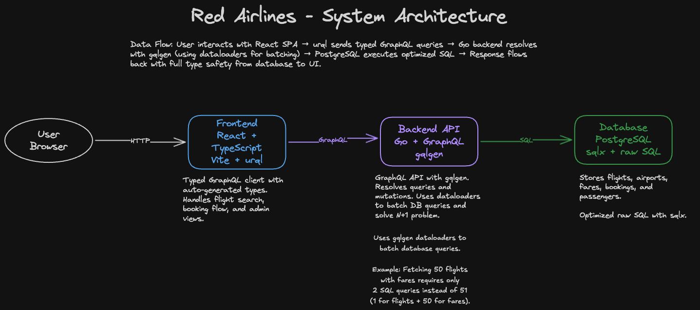

# Red Airlines

A modern full-stack flight booking application built with production-grade technologies: React, Go, GraphQL, and PostgreSQL.

## Demo

[Watch the demo video](https://github.com/davidalecrim1/red-airlines/blob/master/docs/demo-video.mp4)

## System Architecture



## Tech Stack

This project leverages a carefully selected technology stack that prioritizes performance, type safety, and developer experience:

**Frontend**
- **React 18+ with TypeScript**: Type-safe component development with the latest React features
- **Vite**: Lightning-fast build tooling and hot module replacement for optimal developer experience
- **urql**: Lightweight, extensible GraphQL client with intelligent caching
- **Code Generation**: Automated TypeScript types from GraphQL schema ensure end-to-end type safety

**Backend**
- **Go**: High-performance, compiled language with excellent concurrency support
- **gqlgen**: Type-safe GraphQL server implementation with automatic resolver generation
- **sqlx**: Direct SQL query execution with row scanning, eliminating ORM overhead
- **Raw SQL**: Full control over database queries for optimal performance and clarity

**Database**
- **PostgreSQL**: Industry-standard relational database with ACID compliance and advanced indexing
- **Migration-based schema management**: Version-controlled database evolution

## Getting Started

### Prerequisites
- Go 1.21+
- Node.js 18+
- Docker

### Development Setup

1. Install dependencies:
```bash
make install
```

2. Run the application (backend + frontend + database):
```bash
make run
```

This single command runs:
- PostgreSQL database (Docker)
- Go GraphQL API server on `http://localhost:8080`
- React development server on `http://localhost:5173`

3. Test the GraphQL API using Apollo Studio Sandbox:
   - Visit: https://studio.apollographql.com/sandbox/explorer/
   - Paste endpoint: `http://localhost:8080/query`

See `docs/GRAPHQL.md` for detailed GraphQL development guide.

## Why These Technologies?

**GraphQL over REST**: Strongly-typed schema, precise data fetching, and automatic documentation eliminate over-fetching and API versioning concerns.

**Go for Backend**: Compiled performance, built-in concurrency primitives, and static typing make Go ideal for high-throughput API servers.

**Raw SQL over ORM**: Direct SQL queries provide transparent performance characteristics, full PostgreSQL feature access, and eliminate abstraction layer complexity.

**TypeScript Throughout**: End-to-end type safety from database to UI reduces runtime errors and improves refactoring confidence.

**React + Vite**: Modern developer experience with instant feedback loops and optimized production builds.

## Project Goals

This project demonstrates:
- Building a production-ready GraphQL API with Go and gqlgen
- Effective raw SQL query patterns with sqlx
- Type-safe React integration with GraphQL code generation
- Full-stack TypeScript and Go development workflow
- Database migration and schema management best practices
